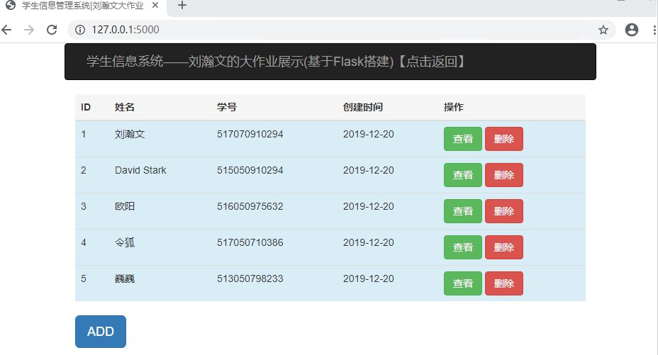
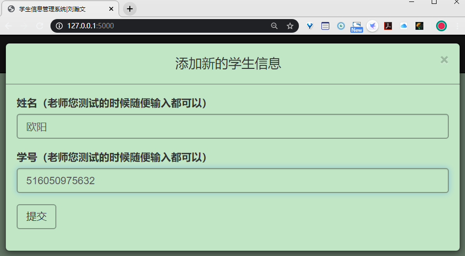
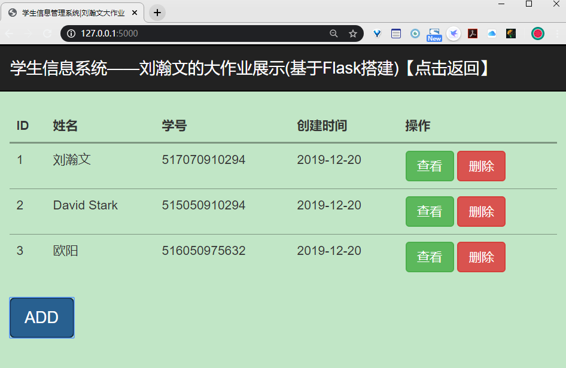
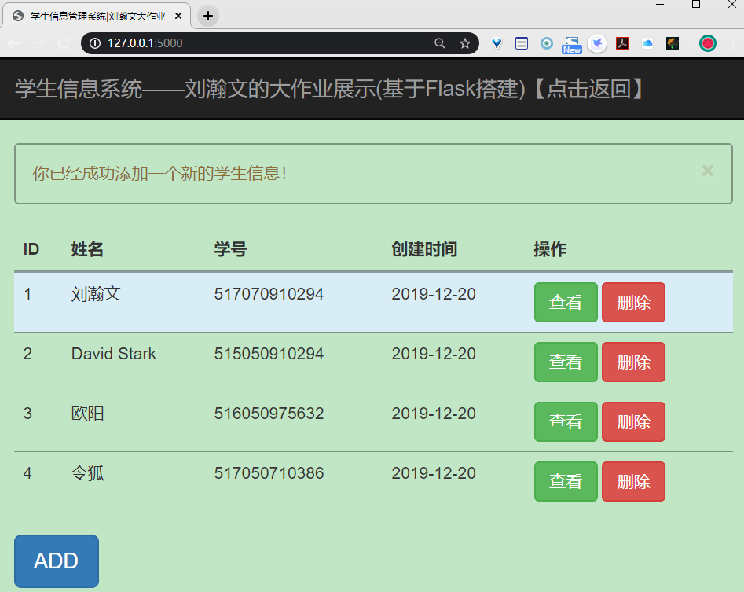
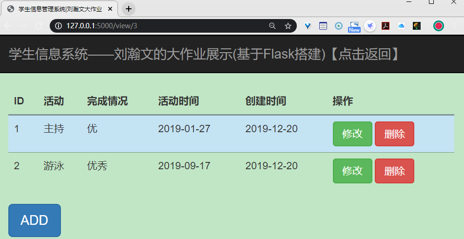
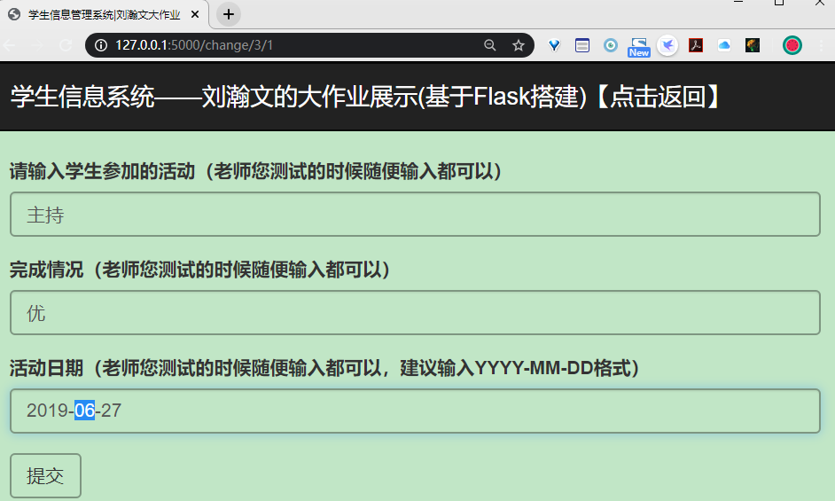

# Python-Programming
SJTU-2019FALL-CS902-Homework & Project

This course teaches Python2. 

I update my code for homework and final project here.

This repo is a basic programming language application.

***I also give detailed description of my final project.***

The link is https://github.com/david990917/Python-Programming/tree/master/Final%20Project .

---

# 概览

我的大作业搭建了两个程序——网站和添加圣诞帽，都是使用`Python2`编程。

接下来的报告中，我会主要阐述我的简单网站搭建，添加圣诞帽的程序作为彩蛋放在最后描述。为了方便老师检查，我会在报告中添加详实的图片；同时也因为环境搭建太过于冗杂，为了方便老师检查，我配置了一台Windows服务器，老师可以远程连接访问，以证实我的代码和实现效果。**环境和准备工作都做好了，老师只用双击我文件夹中的远程连接rdp文件**。

大作业背景
==========

我一直想尝试搭建一个自己的`web`，在选题目调研的时候看到了网上有很多框架推荐，有`web.py`框架、`Flask框架`和`Django框架`。期末想做一个有挑战并且全新从来没有接触过的方向，`Django`我先尝试了几天，但是感觉略有复杂，最后确定使用轻量级`Flask`框架。

在真正写大作业的代码之前，我经历了一周的选题调研，对`Flask`框架能实现的任务有了初步的概念，同时跟着官网上面的教程一步一步搭建了一个初始的单页面程序。

设计思想
========

在大作业中，我决定搭建一个包含两个页面的学生信息管理系统，能够展示我确实对`Flask`框架的概念和操作有了扎实的理解。同时两个页面又需要我对数据库的知识有一个初步的理解和应用。我觉得这样的一个任务对于我这门课来说是一个很好的大作业项目想法。完全全新的内容+很有挑战的设计，应该足够证明我对这门课的认真和重视程度。

我觉得我这个项目设计很贴合计算思维的课程，也很具有挑战和难度，同时对我自身的代码能力能有一个真正的提高。

功能模块
========

我的网页包含两个页面：主页面是所有同学的信息展示，点进去的附属页面是该同学的活动情况。

所有同学的信息展示
------------------

网页有两个方向的请求，一个是GET获取信息，一个是POST上传信息。

在网页最开始打开的一瞬间，框架内部自动调用GET方法，我们只需要完善这个时候Python做什么就可以了。

这个时候我让程序用查询的方式从数据库中取回所有的信息。数据库和展示的方式，我在后面的项目亮点环节中进行详细描述。

在这个页面可以实现添加同学的操作，同时会根据操作返回相应的回应弹窗。同时在每个已添加的同学行后面会支持两种操作：一个是查看，点击后会跳转到对应的子页面；另一个是删除，会删除对应的同学的信息。

单个同学的活动情况展示
----------------------

这个是前面主页面的每个同学的附属页面，绑定的页面链接是`/view/stu_id`。这个时候默认返回该同学的所有活动列表。

页面中同样除了原来的删除操作，也增加了修改的操作。

项目难点和亮点
==============

数据库-sqlite3
--------------

在大作业的项目中，我使用的数据库是`sqlite3`。设计使用这个数据库的原因是配置容易，同时满足我之前完全没有接触过的原则。在设计的过程中，根据网上查找的资料，第一个页面的搜索逻辑还比较容易完成。但是第二个页面，活动是绑定在同学的，所以需要设计一个外键；同时他执行的搜索实际上是基于第一个页面传递进来的`stu_id`，所以还需要设计一种过滤器，对搜索结果进行过滤，只显示当前同学的信息。

数据库-对象关系映射
-------------------

这个是我在边做项目中边发现的一种方法，因为之前没有接触过数据库，从网站上找到的教程来看都是从SQL语言起步的，我大概用了一整天的时间掌握了这种语言的语法：能够实现建表、查询、外键、聚合搜索等。然后在程序中写了较长的SQL语句来实现我期待的搜索功能。但是在实践中，由于我想要变更一下显示的类型[增添一列活动时间项]，发现需要对数据库和数据库语言进行大改，所以我又进行了探索，发现了这样一种方法。

对象关系映射(Object Relational Mapping，简称ORM) 在`Flask`里面是通过`flask_SQLAlchemy`这个库来实现的。需要首先定义`model`，对不同的两个数据库定义他们的类，感觉这样的方式比较像我们`Python`中的`Class`。定义完成这两个类之后，就可以在后面的代码中使用`session`进行添加。

上面这部分陈述说起来很简单，但是在调试过程中，我用了大约两整天的时间才彻底摸清楚，并且现在能够自由地实现对数据库结构进行修改。

表单结构
--------

在实现的过程中，我同样调用了`Flask`组件里面最新的库`flask_wtf`。我们只需要用类似上面所述数据的格式添加对应的信息，他会自动的进行flask里面表单的生成。

修改页面
--------

在修改页面中，网页具有类似的结构和方法。其实在刚载入的时候，也是默认执行`GET`请求，从数据库读信息载入表单。这一点突然让我发现`Python`程序的美，不同的网页架构有着相似的方法和操作。

修改页面绑定的路由也是经过设计的，`/change/stu_id/id`，这样的绑定方法具有唯一性，能更加满足实际环境的应用。

删除页面
--------

删除这个操作一闪而过，容易让人忽略，其实他内部也有着和修改同样量级的代码。

项目思考和提升空间
==================

部署和运行
----------

在实现我的大作业的时候，从始至终我一直想着的两个问题是：

1.  我实现的功能是不是新颖的、独创的、有挑战的？

2.  我实现的功能如何能呈现给老师？

在完成大作业，撰写报告的时候，我有底气自信地回答第一个问题。***我的程序是经过仔细思考，查找了非常多资料，经过好多周熬了好多个夜晚独立设计出来的。***Web框架我之前没接触过（我以前只听说过`Django`，后来调研的时候发现`Flask`更轻量）；数据库应用的是以前从来没有用过的类型；新学习的面向对象方式的数据库方法；静态文件的编写等。

第二个问题却是一直困扰我的问题，我如何能把我一个依赖`Flask`框架的程序，同时有着众多包的一个程序让老师能亲自操作，这是一个让我一直在思考的问题。我尝试学习过`Python`程序的打包、记录环境安装时的命令，并且到另一台电脑上从头执行一遍。但是最后感觉这些方式对于老师检查来说都太繁琐了，最后选择了我自己找一台云服务器，搭建好所有的环境，并且打开初步的页面，老师就可以直接操作了。

**部署**到云服务器平台我也尝试了很多种方案：`aws`的机器网速快，但是访问容易卡死。最后选择了华为云的服务器，通过windows自带的远程连接，***老师您可以直接通过我配置好的rdp文件进行连接，ip和账号密码已经配置好了。***避免临时失效，**环境的ip是`*`，账号`*`，密码是`*`。云主机环境一直可以维持到1月20日。

**运行**Web程序，我已经让它进入运行状态了。老师登录到环境之后会看到左侧是我的代码，右侧是对应打开的本地网页，老师可以直接在本地网页上进行添加、删除、访问等操作。

提升空间
--------

未来考试周结束会尝试使用官方推荐的`Blueprint`蓝图格式来重构我的代码，同时加入登录登出功能，并且部署到一个开放的端口，能够直接通过网址进行远程访问。

彩蛋-添加圣诞帽
===============

我同样在考试周期间完成一个`Python2`程序，因为这个程序比较轻量级，所以只是做为我的大作业的彩蛋部分。

项目背景
--------

考试周接近圣诞节，朋友圈中的大家都希望能在自己的头像上添加圣诞帽，所以我学习网上的资料，独立写出了这个程序。

同时因为这个项目会调用人脸识别库，借此机会也初步了解了深度学习的浅层知识，同时也希望能够丰富我大作业的多样性。

项目实现
--------

使用`Dlib`库和别人预训练好的模型来进行我本地的人脸识别，同时根据人眼睛的位置和人头部的大小，对帽子图片进行缩放，然后放到头部。其中应用到`openCV`库的蒙版，因为没怎么接触过图像处理，所以这部分是基于网上教程，然后独立编程实现的。

项目展示
--------

总结
====

在这次的大作业中，我实现了这样的两个项目，我觉得很有挑战，同时我收获很多。程序让我很多个夜晚都难眠，当程序终于能够显示出我想要的效果的时候，我觉得格外地惊喜和兴奋。

这个学期的后半部分我就已经开始在准备大作业了，每天都投入大量的时间和精力，到最后一周终于把它完成，我真真正正觉得收获了很多，感受到了程序严谨的美和那种艺术精神，也对自己的编程更加有信心了。

感谢老师一学期的倾情相授，感恩！